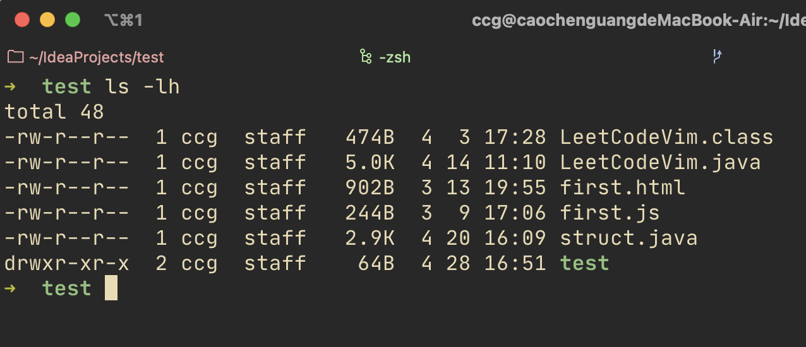

# 零碎笔记

记录日常碎片化笔记。

## macbook

### 终端

当安装了**conda**后，在终端前面会出现一个`(base)`标志，原因是启动终端时会默认加载conda的默认环境。关闭该设计即可。

```shell
[$]conda config --set auto_activate_base false
```

默认情况下，终端会显示计算机名称与用户名，占用过多的终端显示内容。修改文件`/.zshrc` ，现在苹果默认使用该版本终端。

```shell
# 添加
# `%` 是转义字符
export PS1='先要显示的内容'

# 最后用 source ~/.zshrc 激活
```

通过`alias`能够自定义程序的别名，并在终端通过别名启动该程序。可在终端中直接输入当作临时设置，也可以写入配置文件，一直存在。以 macvim 为例，在文件 `.zshrc` 中添加如下：

```shell
alias mvim='Applications/MacVim.app/Contents/bin/vim'
```

当在终端使用命令`mvim`时，将调用macvim中附带的终端版vim。这里没有覆盖终端默认的`vim`命令。

#### iTerm2

一款默认终端替代产品，在类 macOS 下较为流行。是zsh版终端，其他常用的终端软件有bash，shell等。M1版苹果默认终端就是zsh。以前可能是bash。

#### 命令

```shell
# 输出内容到文件
$ echo "text content" > test.txt

# 打印文件内容
$ cat test.txt
```

#### 脚本

脚本第一行`#!/bin/zsh`是指明该文件为一个脚本，切执行脚本的终端路径为`/bin/zsh`。

```shell
# 第一种执行方式
$ /bin/zsh xxx.sh

# 第二种执行方式
$ chmod +x ./xxx.sh
$ ./xxx.sh
```

在正常的执行的脚本过程，都是在当前的shell环境下将参数传给一个子shell。因此一些命令在当前环境不会有效果，需要使用如下执行方式：`. ./xxx.sh` 。

### Font
the google font: `Source code pro` is not a patched font, in this macbook, there is a `source code pro for powerline`, and I installed the `source code pro` font, but for better performence in some place. Like vim-airline, also installed the nerd font version, but the name has been changed to `SauceCodePro Nerd Font Mono`. In some reason as the nerd-font github say.

### word

快捷键：`<c-=>`当前位置开启公式编辑，`<command> + =`转换成数学形式。

### Ranger
由python编写的文件预览程序。通过`brew install ranger`安装。在终端使用`ranger`启动。该程序是支持一个`highlight`的程序的。（不清楚是不是一个程序）同样通过homebrew安装。安装后ranger会自动加载它，为文本文件添加高亮。同时，fzf这样的插件也会自动使用这个程序。

## vim

### 笔记

其他插件：显示当前打开多少个buffer的插件：`bufferline.nvim`。在Arch中，可以使用lunarvim这个版本，比较像IDE。

模糊搜索的插件：`telescope.nvim`。网上看到的，启动界面显示NEOVIM样式的插件：`alpha-nvim`，类似vim-startify。

#### 寄存器（registers）

vim中一些临时存放复制内容的地方。存在多个不同类型的寄存器。

```
1. The unnamed register ""
2. 10 numbered registers "0 to "9
3. The small delete register "-
4. 26 named registers "a to "z or "A to "Z
5. Three read-only registers ":, "., "%
6. Alternate buffer register "#
7. The expression register "=
8. The selection and drop registers "*, "+ and "~
9. The black hole register "_
10. Last search pattern register "/
```

对于寄存器的内容会有三个类别：

```
"c"     for characterwise text
"l"     for linewise text
"b"     for blockwise-visual text
```

#### 调用终端

在vim8版本可以通过命令调用终端，或者在调用终端过程中直接接终端命令将得到结果。

```vim
" 直接在当前窗口下创建一个终端
:term

" 得到终端命令的返回值
" 直接返回运行 test.py 文件的结果
:term python3 test.py
```

### vim-plug

```vim
" 在启动文件 .vimrc 中添加如下配置
" 通过 :PlugInstall 命令自动安装填写的插件

call plug#begin('插件存放的路径')
Plug '插件名'
call plug#end()
```

### vim-airline

显示在窗口下方的状态栏插件。更高级显示需要特殊字体的支持。常用配置

```vim
let g:airline_powerline_fonts=1 " 将这个注释将不使用特殊字体的符号
let g:airline#extensions#tabline#enabled=1

if !exists('g:airline_symbols')
  let g:airline_symbols = {}
endif

let g:airline#extensions#tabline#left_seq='▶'
let g:airline#extensions#tabline#left_alt_seq='❯'
let g:airline#extensions#tabline#right_seq='◀'
let g:ariline#extensions#tabline#right_alt_seq='❮'
let g:airline_symbols.linenr='¶'
let g:airline_symbols.branch='⎇'
let g:airline#extensions#tabline#buffer_nr_show=1
let g:airline#extensions#tabline#formatter='default'
let g:airline_theme='gruvbox'

:set guifont=DejaVu_Sans_Mono_for_Powerline:h15 " 这是将字体设置成特殊字体
```

### vim-airline-theme

管理vim-airline主题配色的插件，一般与vim-airline一起下载。

### gruvbox

一个热门的vim主题配色。由于使用的色彩缘故，需要加上如下配置，注意所有属于该主题的设置都必须放在主题设置命令之前，否则可能会导致无效情况。

```vim
if (empty($TMUX))
  if (has("nvim"))
    let $NVIM_TUI_ENABLE_TRUE_COLOR=1
  endif
  if (has("termguicolors"))
    set termguicolors
  endif
endif
:set background=dark
"设置颜色深浅分别为：soft, medium(default), hard
let g:gruvbox_contrast_dark='medium'

:colorscheme gruvbox

```

### nerdtree

~~vim中一款用于显示文件树的插件。无需配置即可使用，配置映射方便启动与关闭~~

> 已改用coc-explorer

```vim
" 配置按键开启关闭该插件
nnoremap <leader>n :NERTreeToggle<cr>
```

### vim-easymotion

加快查找移动的插件。**在nvim中与coc.nvim插件一起使用会出现coc.nvim乱报错的问题，在配置文件中设置启动vim-easymotion时，停止coc.nvim**。

```vim
autocmd User EasyMotionPromptBegin silent! CocDisable
autocmd User EasyMotionPromptEnd silent! CocEnable
```

### tabular

一款对齐插件通过选中内容，使用 `:Tabularize /xxx`将基于xxx来将选中的内容对齐，简短命令为`:Tab /xxx`

### vim-surround

一款对于 `", ', (, [, {, <tag>` 包裹的数据进行处理的插件，能够快速修改，删除，复制，添加这些包裹符号。

**对tag的变化**

- 变化到tag：`"hello"`, use `cs"<q>`, to `<q>hello</q>`

- 从tag变走：`<q>hello</q>`, use `cst'`, to `'hello'`

### 常用命令

- `:edit filename`来打开或创建一个文件；

- `:bdelete filename/number`关闭缓冲区中对应的文件，但所有文件的排序数值不变；

- Visual模式中，通过`< or >`进行缩进缩出；

- `g + j or k`在同一行中进行上下移动；

- `viw`可以在一个单词的任意位置选中该单词，同样的适用于删除命令，修改命令；

- `:s/old/new/g`将一行内的所有old替换成new，不加`/g`则只会替换第一个匹配到的；

- `:%s/old/new/g`全文替换，不加`/g`就只会替换光标以下的内容；

- `options + i + keys`能够对一些被包括对数据进行操作，其中`options=[c,d,y,v]`, `keys="or[or{等`；

- `m + 任意字母`会将当前行标记成该字母，`' + 任意字母`会跳转到该字母所标记的行。小写字母只在当前文件内跳转，大写字母可以跳转到其他文件（文件被打开时）；

- `:marks`查看但前使用的标记，系统会有一些默认标记；

- `:delmark 字母`删除该字母的标记；

- `"+y`将内容复制到系统剪切板中，同理，使用`"+p`将系统剪切板中的内容复制过来，需要添加如下配置，对于nvim来说需要额外的终端剪切板工具；

  ```vim
  set clipboard=unnamed
  ```

- `g+d`能够跳转到当前函数或变量定义的地方，实现同样功能的还有`<c+]>` ；

- Normal模式中，按`u`是撤回功能，`<c-r>`是重做功能。

- `<c-f>`向后翻一页，`<c-b>`向前翻一页。快速移动；

- **vim 中有三种文字对象，段落，句子，单词**，段落是以空行进行区分，使用`{ and }`进行段落的上下移动。句子鉴定同中文标点，但后面加一个空格回车等符号，使用`( and )`进行句子上下移动。单词规则同英文。**但是大写的 w 只是将空格，回车，tab键分割的对象看成一个词**；

- `* or #`能够快速进行全字匹配，是一个快速搜索按键，若在前面加上`g`则是普通的字符匹配，只要包含改词的部分，都会显示；

- 通过命令行的方式进行全字匹配（普通搜索都不是全字，只要部分有都会显示）：`/\<word\>`，该命令从光标向下查找单词word，字符`?`是向上搜索，操作同向下搜索；

- 在NORMAL模式下，`H`, `M`, `L`会将光标移到屏幕顶部，中间，底部。

- `J`将下一行与当前行合并，中间会自动加入空格。也就是将换行符更改成空格。

- `zz`将当前行移动到屏幕中央，`zt`, `zb`分别为顶部与底部，另一种内容滚动操作。

- `3At<esc>`会在行尾添加三个t。

- `<c-g>`显示当前文件信息——文件路径，当前所处文件位置（百分比）。

- `f`与`F`为在当前行所有字符，一个向后，一个向前。

- 通过`<c-v>`选中的块，即便每行的长度不一样，但通过`$A xxx`会在每行尾部添加xxx 。

- 取消行尾的空格`:%s/\s\+$//`

- Vim-surround插件中为一个单词添加括号是：`ysiw)`，倒数第3，2个字符是文本命令，修改可以将单词扩充到一个以上

- `<c-e> or <c-y>` 上下滚动一行

- 在visual模式中选中一列数据后，按下`g + <c-a>`能够自动将数字升序。

- 直接使用`bdelete`将直接关闭光标所在的buffer。对于运行python等程序的临时窗口最好这样关闭窗口，避免使用`[b`这样的命令时跑到这些临时窗口中。

### coc-nvim

一款代码提示插件平台。

#### coc-java

直间通过`:CocInstall coc-java` 安装即可，但该插件可能会出现一个 **highlight** 问题的报错。需要修改一下插件平台的一个函数。找到插件安装位置。MacBook自定的位置为 `~/.vim/plugged/` 下。

```vim
" 修改文件：coc.nvim/autoload/coc/highlight.vim
" 第 628 行左右，原本内容为
function! s:prop_type_hlgroup(type) abort
  return prop_type_get(a:type)['highlight']
endfunction

" 修改成如下
function! s:prop_type_hlgroup(type) abort
"  return prop_type_get(a:type)['highlight']
  if a:type=~# '^CocHighlight'
    return strpart(a:type, 12)
  endif
  return get(prop_type_get(a:type), 'highlight', '')
endfunction
```

该问题在 coc-nvim 上的 [issues](https://github.com/neoclide/coc.nvim/commit/03a532b544930d6957493933089135d5fa3e7be6)。

#### coc-pyright

通过 `:CocInstall coc-pyright` 安装，同时 python 环境需要安装好 pylint。对于 python 或 pycharm 创建的虚拟环境，只要 vim 编辑器的当前工作目录是在项目的根目录，插件会自动使用虚拟环境的解释器。但是 conda 安装的虚拟环境可能不会（也许是因为自己创建的 conda 虚拟环境名称是 work，而不是一般的 env，venv等）。这时就需要在项目的根目录下创建一个 `pyrightconfig.json` 文件，在里面添加：

```json
{
    "venvPath": ".", // 因为 vim 的工作目录会放到项目根目录，所以虚拟环境路径为当前路径
    "venv": "虚拟环境名称（目录名称）"
}
```

在 coc-setting.json 中可已设置 coc.nvim 平台下插件的默认设置。对于安装了多个版本的 python，可能需要修改默认的 python 解释器。

```json
// 通过 :CocConfig 命令调出 coc-setting.json 文件
{
    "python.pythonPath": "python解释器路径"  // macbook 下默认为 /usr/bin/python，是python2版本
}
```

#### pylint

在使用某些三方库时，可能会提示该库的对象不存在正确的方法名，是因为这些库是用C写的扩展，pylint 无法识别内部。也有人说是 pylint 默认值只信任 C 扩展，而报错的三方库不是 C 扩展。需要在项目的根目录创建 pylint 的局部配置文件，并添加白名单。

```shell
$ pylint --generate-rcfile > .pylintrc
// 在文件 .pylintrc 中添加如下
extension-pkg-whitelist=三方库名
例如：
extension-pkg-whitelist=lxml
```

**关于 pyright 会一直提示一些不是错误的错误，在 `CocConfig` 中加入配置：`python.analysis.typeCheckingMode: off`**

关于代码里面写 TODO 注释会出现提示信息，是因为本地的 LSP 等插件是不建议出现 TODO 注释的。直接使用注释就要可以，一般就公共工程需要使用 TODO 注释，用来提示短时间内补全功能。


## Linux

### Arch Linux

自由定制度高度Linux发行版本——Arch Linux。可以折腾。安装好后，一般都会安装一个图形见面。除了像Ubuntu一样的Linux版本自带的图形界面的产品外，还有一种窗口管理界面。如DWM——b站up主TheCW（参考vim配置视频主）就是用的这个。

### chmod

修改文件权限的命令，对于类linux系统而言，将权限划分成三个成分，所有者(owner)，组成员(group)，其他(others)。对文件的操作分为读(r)、写(w)、执行(x)。通过 `ls -l` 命令可以查看文件权限信息。



第一个字符用来区分文件与文件夹，`-`表示文件，`d`表示文件夹。接下来三个字符为一组，分别表示所有者，组成员，其他成员对该文件的操作权限。没有对应的权限时用短横线表示。第二列表示文件的硬连接数量，第三列表示文件所有者，第四列为所有者的所属组，第五列为文件大小，第六，七，八列是最后修改时间。

#### 数值方式（OCTAL）

网上常见的方式，最常见的一个命令就是`chmod 777 filename`，这个命令其实是将三个权限给所有用户。数值方式修改权限时，是一次性修改三个权限对象的，即所有者，组，其他。数值代表权限数值的和。

| owner     | group     | others    |
| --        | --        | --        |
| r   w  x  | r  w   x  | r  w  x   |
| (4)(2)(1) | (4)(2)(1) | (4)(2)(1) |

所以777就是三个权限对象都有读写执行的权限。

#### 符号方式（Symbolic）

这种方式下更像平时写程序时的参数传递一样，前面写参数名后面写相应的内容。表示形式如下：

```bash
$chmod [option] references operator mode filename
example, do not use [option]
$chmod u+rw test.txt
```

references:

- u: owner
- g: group
- o: others
- a: all users

operator:

- +: add mode to specified classes
- -: remove mode to specified classes
- =: exact mode to specified classes (will remove the mode which before have)

mode:

- r: read
- w: write
- x: execute

##  Git

```bash
# 查看当前用户配置
$ git config --global --list

# 修改当前用户的用户名与邮箱
$ git config --global user.name "user name"
$ git config --global user.email "email address"

# 若未在仓库加入本机 ssh 公钥
# 先看本机是否有公钥
$ ls -al ~/.ssh
# 若存在公钥，就会显示文件名，将带有 xxx.pub 文件的内容复制到 github 设置中

# 本机没有，需要生成，先配置本地用户信息
$ ssh-keygen -t ed25519 -C "your_email@example.com"
# 若当前版本低，不支持 ed25519 算法，使用下面命令
$ ssh-keygen -t rsa -b 4096 -C "your_email@example.com"
# 对于弹出的消息按回车即可，内容大概是问存储位置，设置使用该密钥时的密码等。
```

```bash
# 对新的空仓库推送
# 若本地也没有文件，只是建立本地与远程连接时
$ git init
$ git add README.md
$ git commit -m "first push"
$ git branch -M main
$ git remote add origin remote_address
$ git push -u origin main
```
```bash
# 查看本地与远程的差别
$ git fetch origin
$ git status

# 查看远程连接地址
$ git remote -v
```

## python

### 正则

正则匹配是，模式字符与资源字符的编码要统一。转意符为反斜杠 `\` 。正则表达式以两个反斜杠开头 `\\` 。	在python中，对字面意思的字符串使用转意符号时，都会产生一个警告，在未来甚至会称为一个语法错误。解决的方法是使用原始字符串表达形式，即 `r""` 。

官方文档：https://docs.python.org/3/library/re.html

通配符贪心与非贪心方式， `.`, `*`, `+`, `?`, 为正则中的通配符，点表示匹配任意一个字符，星号表示匹配前面一个字符0次及以上，加号是1次及以上，问号是0次或1次。问号与前面的通配符使用就会使匹配模式变成非贪心——尽可能少匹配字符。例如：对于字符串 `<a>sdf<c>`，在通常的贪心模式下 `<.*>` 会匹配整个字符串，而非贪心写法 `<.*?>` 只会匹配到第一个a标签。

```python
>>> target = 'this is a string, and test.'
>>> pa1 = re.compile(r'.*?is(.*)a')  # 括号内用贪心匹配
>>> pa2 = re.compile(r'.*?is(.*?)a')  # 括号内用非贪心
>>> res1 = re.match(pa1, target)
>>> res2 = re.match(pa2, target)
>>> res1.group(1)
' is a string, '
>>> res2.group(1)
' is '
>>> # group(0)显示当前匹配的整个字符是哪些，以及对于原字符串的下标
```

